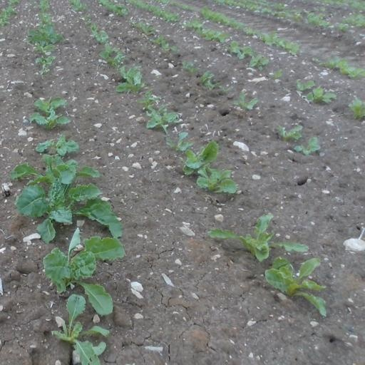
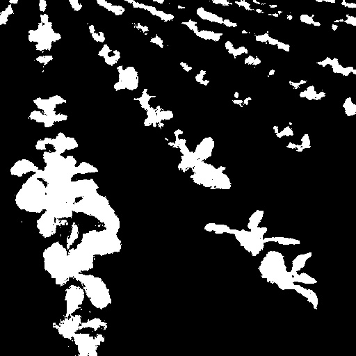
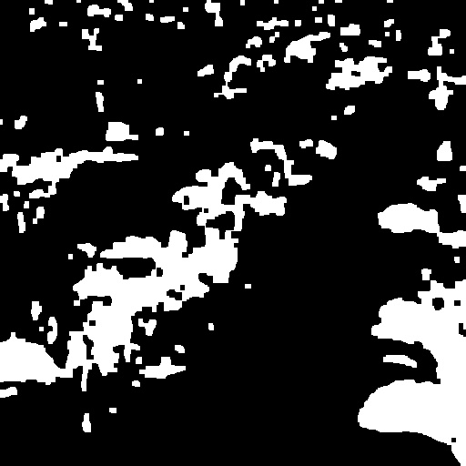

## Output Analysis

The pipeline was tested on several agricultural field images containing plants arranged in rows.

The test images included different conditions such as shadows, weeds that should ideally be ignored, varying row visibility, curved rows, and different crop sizes.

### Representative Pipeline Example

For `image_02_shadow.jpg`, I saved the main intermediate processing stages as:

- `original.jpg`
- `vegetation_mask.jpg`
- `clean_mask.jpg`
- `edges.jpg`
- `all_detected_lines.jpg`

The processing pipeline follows this order:

1. Original image - the unprocessed agricultural field image.

2. Vegetation mask - white pixels represent areas classified as vegetation, while black pixels represent everything else, such as soil.

3. Cleaned vegetation mask - morphological opening and closing, which use erosion and dilation, remove small areas of white noise and help fill small gaps or holes in the vegetation mask.

4. Edge detection - identifies the boundaries of the segmented vegetation so that line-like structures can be detected in the next stage.

5. Crop-row candidate detection - the Hough line transform detects straight line segments that may correspond to crop-row structure. The detected lines can then be filtered to remove unlikely row candidates.

#### Original

#### Vegetation Mask

#### Cleaned Mask

#### Edges

#### Detected Lines

### Results Across Test Images

For the remaining test images, I focused on the final crop-row candidate output rather than saving every intermediate processing stage.

| Image | Condition | Result | Main Issue |
|---|---|---|---|
| `image_01_easy_detected.jpg` | Clear crop rows | Moderate | With the current filtering parameters, only one prominent row was detected |
| `image_02_shadow_detected.jpg` | Strong shadows | Good | Best-performing example; the program successfully detected three visible rows |
| `image_03_sparse_weeds_detected.jpg` | Sparse weeds | Poor | Irregular vegetation patterns caused intersecting line candidates |
| `image_04_dense_weeds_detected.jpg` | Dense weeds | Poor | Dense weeds made it difficult to distinguish crop-row structure, producing intersecting line candidates |
| `image_05_curve_detected.jpg` | Curved rows | Moderate | Three row segments were detected correctly, but one incorrect intersecting line was also detected |
| `image_06_large_crop_detected.jpg` | Larger plants | Moderate | Row structure was identified, but overlapping vegetation created additional line detections |

### Key Observations

- HSV thresholding works reasonably well when green vegetation is clearly separated from the soil.
- Morphological filtering helps remove isolated noise and fill small gaps in the vegetation mask.
- Dense weeds are difficult because the current method cannot distinguish crop plants from other green vegetation.
- Straight-line detection works better on clearly visible, relatively straight rows than on curved or irregular rows.
- Lighting and shadows can affect segmentation quality.
- One of the largest limitations is sensitivity to irregular crop alignment. When vegetation does not form clear parallel rows, the Hough transform may detect diagonal or intersecting line candidates.

### Limitations

This project uses a classical computer-vision baseline rather than a trained machine-learning model. The vegetation thresholds and line-detection parameters are manually selected, so performance varies across lighting conditions, vegetation density, crop alignment, and field structure.

The current method also detects geometric line patterns rather than understanding whether a particular plant belongs to a crop or a weed. This makes dense weeds and irregular vegetation especially challenging.

A future improvement would be to compare this classical computer-vision baseline with a semantic segmentation approach such as U-Net.